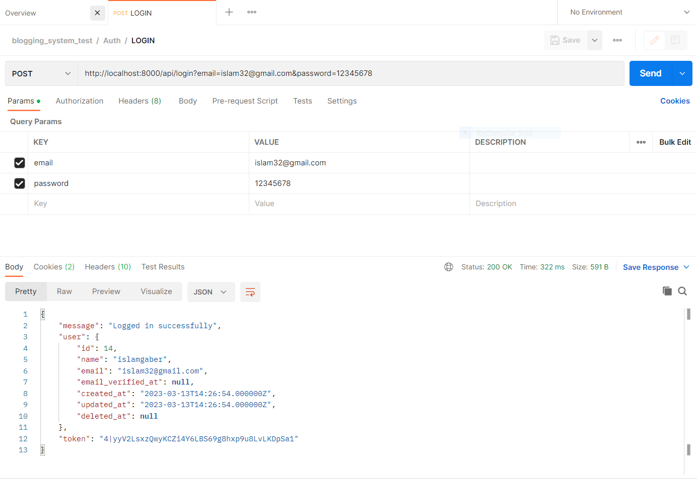
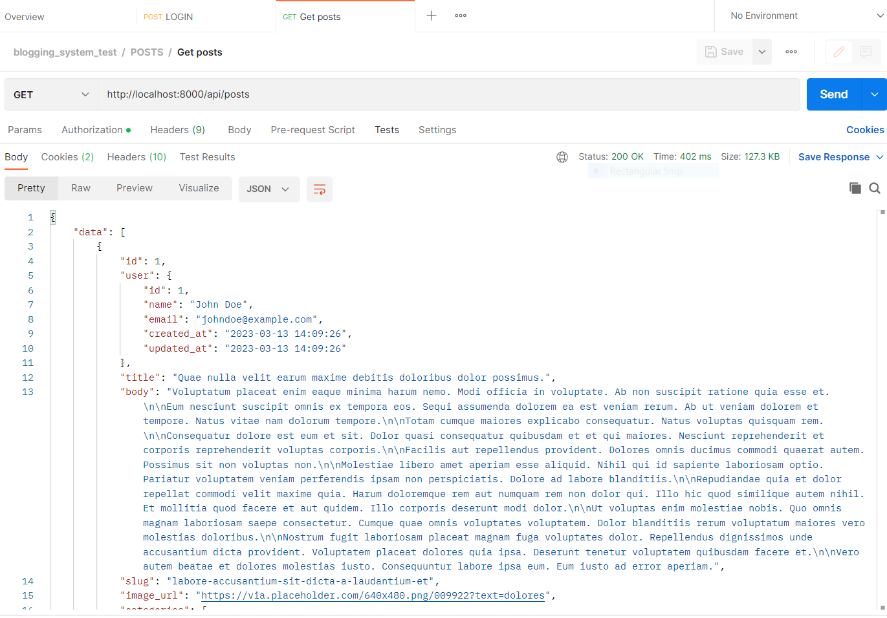

<p align="center"><a href="https://laravel.com" target="_blank"></a></p>

<p align="center">
<a href="https://travis-ci.org/laravel/framework"></a>
<a href="https://packagist.org/packages/laravel/framework"></a>
<a href="https://packagist.org/packages/laravel/framework"></a>
<a href="https://packagist.org/packages/laravel/framework"></a>
</p>

## Getting Started

* create database in phpMyAdmin
* copy ```.env.example``` file add rename it to ```.env```
* conigration database in ```.env```

## inistallation and run

This is an example of how to list things you need to use the software and how to install them.

```sh
   composer install
   php artisan migrate
   php artisan db:seed
   php artisan serve
  ```
## Database diagram

<div align="center">
    
  </a>
 </div>
 
 DB Link: [https://dbdiagram.io/d/640f50b0296d97641d879327](https://dbdiagram.io/d/640f50b0296d97641d879327)
 
## Postman

You can follow these steps to import a file in Postman:
* Open Postman and click on the "Import" button located at the top-left corner of the screen.
* Choose the type of file you want to import, such as a Postman Collection or a Swagger file, and select this file blogging_system_test.postman_collection.json.
* After selecting the file, Postman will import it and create a new collection or request.
* You can then edit the imported collection or request as needed and use it to test your API.

<div align="center">
    
  </a>
 </div>
 
 <div align="center">
    
  </a>
 </div>
